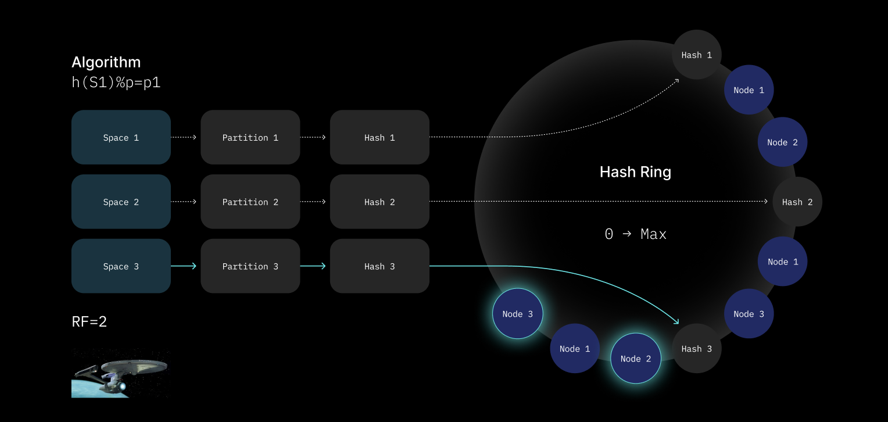

# Networking and Infrastructure

`any-sync` operates seamlessly on local devices and local networks, but for reliable collaboration over the internet, an external infrastructure layer is necessary. While pure P2P achieves \~80–90% connectivity on the public internet using STUN, ICE, and partial IPv6 deployment, \~10–20% of cases fail due to challenges like symmetric NATs, restrictive firewalls, or network policies. These gaps necessitate relays (e.g., TURN) and highlight the need for a robust backup infrastructure to ensure reliability.

To address this, `any-sync` uses a semi-federated infrastructure managed by sync providers, offering optional connectivity without managing user identities. This infrastructure ensures data backups, global accessibility, and smooth coordination across networks. Built on an encrypted DAG data structure,`any-sync` enables channel creators to retain full ownership while syncing changes across devices, either directly, via self-hosted machines, or through providers offering syncing and backup services.&#x20;

Optimistic sync powers scalable communication channels with high performance. Channels remain operational even during provider transitions, with no switching costs. Providers are restricted from altering ACLs, encryption keys, or channel contents; their only leverage is service withdrawal. Decentralized backups safeguard data recovery, with snapshot intervals defined by on-chain smart contracts. Channel owners can further mitigate risks by choosing multiple providers for redundancy.


Multi-provider support and decentralized backups are under development. ETA 2Q 2026


***

### Federated Infrastructure

`any-sync`’s infrastructure follows a **federated** approach. Providers are organized into “Subnets,” each running a specific set of nodes (Coordinator, Sync, File, and Consensus). Users are free to choose which provider(s) they want to work with, and they can self-host the infrastructure for complete independence if desired.

**Providers** deliver the following services:

1. **Synchronization and replication** of Channels between clients
2. **Storage** of Channel data (structured objects and binary files)
3. **Backup** of Channel data and user identities/metadata
4. **Networking** assistance, bridging local devices to the global network
5. **Engineering support** for specialized help

#### Subnets

A **Subnet** is a collection of nodes managed by one or more providers. Each Subnet has its own Coordinator Node(s) and runs a specific configuration of Sync, File, and Consensus Nodes, all tied together by a “Subnet Configuration” that describes the network topology.

***

### Node Types

`any-sync`’s infrastructure comprises four main node types: **Coordinator Nodes**, **Sync Nodes**, **File Nodes**, and **Consensus Nodes**.

<figure><figcaption></figcaption></figure>

#### 1. Coordinator Nodes

Coordinator Nodes handle discovery and orchestration within a Subnet:

* **Subnet Topology**: Identify which Sync, File, and Consensus Nodes operate in the Subnet.
* **Configuration Distribution**: Maintain a “Subnet Configuration” and share it with all nodes/clients.
* **Channel Routing**: Map each Channel’s ID to the appropriate Sync Node(s) using consistent hashing. Clients query a Coordinator to discover where a Channel is stored.
* **Subnet Authorization**: Sign Channel headers, allowing a Channel to use that Subnet for syncing and storage.

#### 2. Sync Nodes

Sync Nodes are responsible for storing and exchanging Channel data:

* Once a client obtains subnet details from a Coordinator, it connects securely to the assigned Sync Node(s).
* Each Channel typically lives on multiple Sync Nodes for redundancy and availability.
* Sync Nodes appear as always-online peers, so any offline device can retrieve missed updates later.

#### 3. File Nodes

File Nodes handle storage and retrieval of larger binary data:

* `any-sync` uses an IPLD-based data structure for files.
* When a client requests a file, File Nodes supply the data if the client is authorized.
* Clients can also share files directly over LAN/P2P if they possess the data locally.

#### 4. Consensus Nodes

Consensus Nodes ensure a single, consistent source of truth for Access Control Lists (ACLs). Although most collaboration can be done entirely offline, ACL changes (e.g., adding or removing members) require consensus to avoid conflicts:

* They use the RAFT protocol to handle concurrent modifications, node failures, and other distributed-system edge cases.
* Sync Nodes submit signed ACL changes; Consensus Nodes validate them.
* The validated ACL state is signed with a Subnet “Network Key” and propagated back to all Sync Nodes.

In the future, some or all consensus logic may move onto a blockchain, further decentralizing trust.

***

### Peer Retrieval: From Local P2P to Global Collaboration

#### Local P2P

`any-sync` supports pure local collaboration. Via mDNS:

1. A device broadcasts queries for `any-sync` peers on the LAN.
2. Responding devices share their IP addresses.
3. The requesting device fetches authorized Channels and files directly, without needing an external server.

#### Global Networks

For internet-scale collaboration:

1. A client queries a **Coordinator Node** to find the **Sync Node** responsible for the user’s Channel(s).
2. It connects securely to that Sync Node for updates and to push new data.
3. Files come from designated **File Nodes**.

When NATs, firewalls, or policies block direct connections, a fallback relay mechanism ensures connectivity so that devices can still exchange data.

#### Hybrid Mode

Devices can combine local collaboration with a remote infrastructure. For example:

* **Device A**: Has internet access and talks to external Sync/File Nodes.
* **Device B**: No internet access but on the same LAN as A.

Device A serves as a bridge, forwarding B’s updates to the internet-based Sync Node and relaying global changes back to B over local P2P.

***

### Scalability and Load Distribution

#### Lightweight Client Connections

Running a full Distributed Hash Table (DHT) on every client can flood resource-limited devices (like mobile phones) with thousands of connections.`any-sync` avoids this by:

* **Limiting Client Peers**: Clients connect to a small set of stable peers, usually the Sync Nodes.
* **Coordinator-Provided Topology**: A coordinator node determines which Sync/File Nodes handle a user’s Channels.

This arrangement lowers overhead while ensuring a reliable, scalable network.

#### Two-Layer Hashing

`any-sync` uses a two-tiered hashing approach to distribute load evenly:

1. **Modular Hashing**
   * A Channel ID is hashed, mapped to a “partition,” and quickly associated with a primary node.
2. **Consistent Hashing**
   * Each partition is hashed onto a ring of nodes.
   * The closest node(s) on the ring host that partition.
   * When nodes join or leave, partitions reshuffle (“reshard”) smoothly to balance load.

<figure><figcaption></figcaption></figure>

If a node is overloaded, additional heuristics redistribute partitions to keep the system efficient at scale.

***

### Summary

`any-sync` offers a powerful hybrid of local-first and optional global infrastructure:

* **Local P2P**: Devices on the same network discover each other and share data without external dependencies.
* **Federated Providers**: Infrastructure “Subnets” supply global accessibility, backups, and consistent access control.
* **Robust Node Types**: Coordinators manage topology and routing; Sync Nodes store and exchange data; File Nodes handle binaries; and Consensus Nodes maintain a single source of truth for ACLs.
* **Efficient Load Handling**: Clients avoid heavy DHT responsibilities, and load is distributed among Sync Nodes via modular and consistent hashing.
* **Flexible Trust Model**: Providers cannot modify Channel encryption or ACLs; they only offer storage and relay services. Switching providers is simple, and redundant providers enhance reliability.

From small teams collaborating purely offline over LAN to large-scale organizations needing always-available infrastructure, `any-sync` aligns with diverse usage scenarios while maintaining privacy, security, and scalable performance.
