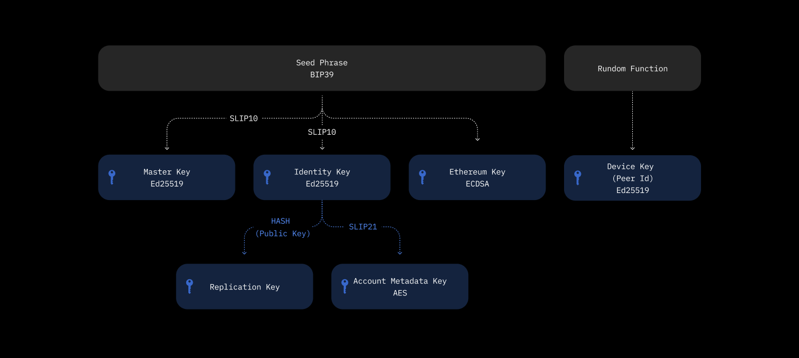
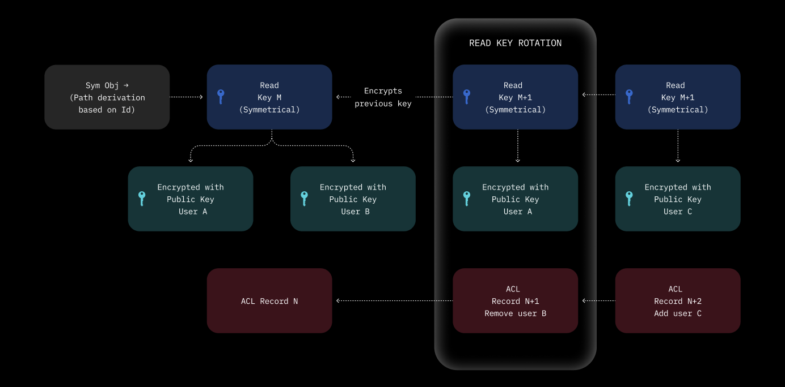

`any-sync` uses a **channel** (or **Space**) abstraction to sync and share data across multiple devices and users. Channels are secured through end-to-end encryption and employ user-owned keys derived from a BIP-39 mnemonic phrase. This design ensures that changes are cryptographically signed and encrypted, enabling offline creation of channels and peer-to-peer synchronization without requiring continuous access to any external network or chain.

Currently, peer-to-peer (p2p) syncing operates over local networks using the mDNS protocol, with plans to expand globally using relay nodes. When only two participants collaborate, no external consensus mechanism is required. However, if three or more users want to share a channel, an **Access Control List (ACL)** must be maintained. Any modifications to the ACL (e.g., changing permissions or adding/removing members) are validated by a **Consensus Node**, which can be a blockchain or a protocol using a consensus mechanism like RAFT. This approach helps to handle edge cases of distribted systems while ensuring channel ownership.

All data—both at rest and in transit—undergoes end-to-end encryption, meaning sync providers cannot read channel contents. Channels operate independently from any particular chain, and you only need access to an external network or blockchain when modifying the ACL or hosting network topology configuration.

## Vault & Cryptography

### Vault Inception

When users create a **Vault**, a set of cryptographic keys is derived from a BIP-39 **Seed Phrase** (12 words). This process occurs entirely offline, ensuring that private keys stay on the device. The following keys are generated:



* **Master Key**\
  Used to sign or authenticate an Identity within an ACL record, and to recover an Identity if necessary.
* **Identity Key**\
  Serves as the owner's public key for the Vault, signing Space headers in an ACL record.
* **Ethereum Key**\
  Enables signing of Ethereum transactions, utilized by the Any Naming System (ANS) if required.
* **Replication Key**\
  Derived from the Identity, used for load balancing and partitioning of Spaces across Sync Nodes.
* **Identity Metadata Key**\
  Used to encrypt metadata of an Identity in ACL records.
* **Peer (Device) Key**\
  An Ed25519 key pair for peer-to-peer networking and handshake processes.

Each key fulfills a unique role within `any-sync`'s cryptographic framework to manage identity, access, and encryption.

### Channel Creation

When a user creates a channel, an **ACL root record** is generated using keys from the Vault. This creation occurs offline (client-side), and all Objects and Changes in the channel become encrypted with the ACL's keys. This guarantees full ownership and control of the channel by its creator until they decide to share it.

### Channel Sharing

To share a channel with others, the client generates a new ACL record containing the new identities' public keys. From that point on, all Objects in the channel use this updated ACL record for encryption. Each new ACL record also encrypts the prior record's key, forming a chain of encryption that allows authorized members to decrypt previous states. Adding or removing members or changing access levels repeats this process. These operations require a connection to the **Consensus Node** (on-chain or off-chain) to validate and finalize ACL updates.

## Primitives

* **Vault**\
  A local abstraction layer that stores and manages a user's set of cryptographic keys.
* **Seed Phrase** (BIP-39)\
  A 12-word mnemonic used to generate cryptographic keys. The BIP-39 standard provides a fixed dictionary of 2048 words.
* **Master Key**\
  An Ed25519 key pair (SLIP10) derived via a derivation path of `m/44'/code'/index'`. Used to authenticate or recover an Identity.
* **Identity Key**\
  Another Ed25519 key pair (SLIP10) from the derivation path `m/44'/code'/index'/0'`. Serves as the public Identity of the Vault, signing channel headers in ACL records.
* **Device Key (Peer Key)**\
  A random Ed25519 key pair created at Vault inception, acting as a Peer ID in a hosting provider's network. Manages peer-to-peer handshakes (Diffie-Hellman and Anytype Handshake).
* **Ethereum Key**\
  An ECDSA key pair from the derivation path `m/44'/60'/Index'/0/0`, supporting Ethereum transactions for the Any Naming System (ANS).
* **Replication Key**\
  Derived from the Identity and used in consistent hashing to determine which Nodes synchronize a given Space.
* **Metadata Key**\
  An Ed25519 key pair that encrypts Identity metadata in ACL records.
* **Read Key**\
  A symmetric AES key that grants read access in ACL records. Encrypted by each authorized member's public key.
* **Channel Id**\
  A CID (Content Identifier) that uniquely represents a channel. It is generated using a combination of the Identity and Replication Key, ensuring channel authenticity.
* **ACL (Access Control List)**\
  A strictly ordered list of permission records. Each channel has one ACL, and each record describes additions/removals of Identities, key rotations, or permission changes.
* **ACL Record**\
  An immutable entry in the ACL's strictly ordered list. References the Master Key, Identity Key, Metadata Key, and Read Key to grant or deny operations on Objects within a channel.
* **ACL Root**\
  The first ACL record, created offline in the client's Vault. It establishes the channel's foundational ownership and encryption.

## ACLs in Detail

An **ACL** is a content-addressable data structure whose ID corresponds to the ID of its initial (root) record. The ACL forms a strictly ordered list of records; the most recent record is known as the "head." Each record may detail:

* Adding a new Identity
* Modifying or removing an existing Identity
* Changing encryption keys
* Adjusting permissions (e.g., read, write, own)

### ACL and Encryption

1. **Encryption of Spaces, Objects, and Changes**
   * A client initiates a Change, which is encrypted with the Object's symmetric key.
   * This Object's key itself is derived from the Space's current symmetric key (managed by the ACL), combined with the Object's CID.
   * The Space's symmetric key is encrypted for each current member of the Space, and this key encrypts all previous keys, forming a chain that allows authorized members to decrypt the entire history.
2. **Encryption of Files**
   * Each File has its own symmetric key for encrypting contents.
   * This key is stored in a "File Object," itself encrypted using the ACL-based approach.
3. **Verification of Changes**
   * All Changes are signed by an Identity Key, ensuring cryptographic verification of the change origin.



### ACL Roles

These roles define each member's level of authority within a channel:

```protobuf
enum AclUserPermissions {
    None = 0;
    Owner = 1;   // Can invite/remove members, edit Objects, and remove Space from a Subnet
    Admin = 2;   // Can invite/remove members, edit Objects
    Writer = 3;  // Can add/edit Objects
    Reader = 4;  // Can only view Objects
}
```

* **Owner**: Full control, including reconfiguring or removing the Space from a subnet.
* **Admin**: Invite/revoke members, edit access levels, and modify Objects.
* **Writer**: Create and modify Objects.
* **Reader**: Read-only access.

### ACL Keys Rotation Operations

ACL Records can include various operations to update keys and permissions:

* **Invite** / **Revoke Invite**
* **Request to Join** / **Accept Request** / **Decline Request**
* **Remove Account** / **Remove Account Request**
* **Change Permission** / **Change Permissions**
* **Change Read Key**
* **Add Accounts**
* **Cancel Request**

Below are example protobuf messages illustrating ACL record structures:

```protobuf
message AclRoot {
  bytes identity = 1;
  bytes masterKey = 2;
  string spaceId = 3;
  bytes encryptedReadKey = 4;
  int64 timestamp = 5;
  bytes identitySignature = 6;
  bytes metadataPubKey = 7;
  bytes encryptedMetadataPrivKey = 8;
  bytes encryptedOwnerMetadata = 9;
}
```

```protobuf
message AclContentValue {
  oneof value {
    AclAccountInvite invite = 1;
    AclAccountInviteRevoke inviteRevoke = 2;
    AclAccountRequestJoin requestJoin = 3;
    AclAccountRequestAccept requestAccept = 4;
    AclAccountPermissionChange permissionChange = 5;
    AclAccountRemove accountRemove = 6;
    AclReadKeyChange readKeyChange = 7;
    AclAccountRequestDecline requestDecline = 8;
    AclAccountRequestRemove accountRequestRemove = 9;
    AclAccountPermissionChanges permissionChanges = 10;
    AclAccountsAdd accountsAdd = 11;
    AclAccountRequestCancel requestCancel = 12;
  }
}
```

## Summary

`any-sync`'s **Access Control** and **Encryption** model relies on client-owned cryptographic keys, generated from a BIP-39 seed phrase. This design enables users to create, share, and manage channels entirely offline. Multi-user collaboration leverages ACLs, validated by a consensus mechanism to handle complex permission logic securely.

* **Channels** remain independent of any chain until an ACL or it's change is required.
* **Vault-based key management** ensures each user retains ownership of their cryptographic assets.
* **End-to-end encryption** covers all data at rest and in transit, protecting users' privacy.

This architecture strikes a balance between flexibility—enabling purely local or peer-to-peer setups—and security, with optional integration into broader consensus networks or blockchains.
